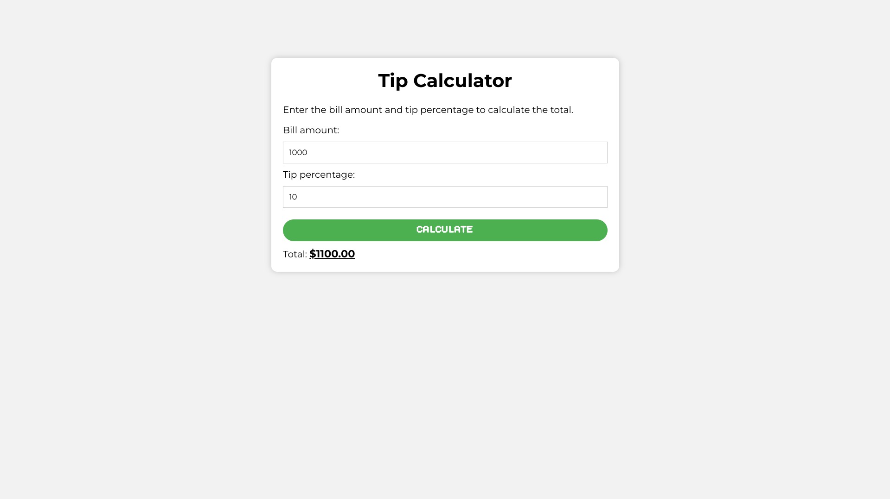

# Tip Calculator 💰

A simple and interactive **Tip Calculator** built with HTML, CSS, and JavaScript.  
Enter your bill amount and tip percentage to calculate the tip and total amount instantly!

---

## 🚀 Features

- Enter **bill amount** in dollars
- Enter **tip percentage**
- Calculate **tip** and **total bill**
- Beginner-friendly and responsive design

---

## 🎨 Screenshot



---

## 🛠️ Technologies Used

- HTML
- CSS
- JavaScript

---

## 📁 Run Locally

1. **Download or clone the repository**

```bash
git clone https://github.com/your-username/tip-calculator.git
